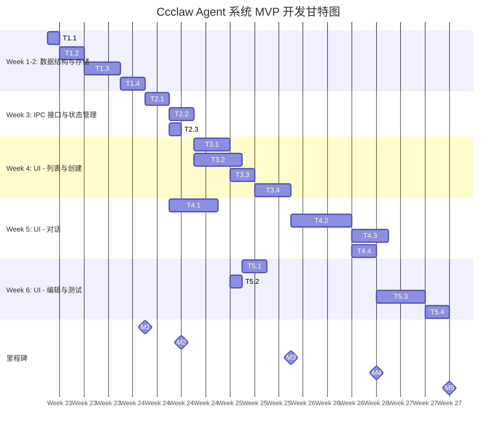

# Ccclaw Agent 系统 - 研发团队协作计划

&gt; **文档版本**: 1.0  
&gt; **创建日期**: 2026-06-08  
&gt; **项目**: Ccclaw 本地化智能 Agent 系统

---

## 目录

- [一、团队组织架构](#一团队组织架构)
- [二、研发流程规范](#二研发流程规范)
- [三、任务分配与里程碑](#三任务分配与里程碑)
- [四、协作机制与工具规范](#四协作机制与工具规范)
- [五、技术实现指南](#五技术实现指南)
- [六、质量保证计划](#六质量保证计划)
- [七、风险评估与应对](#七风险评估与应对)

---

## 一、团队组织架构

### 1.1 团队角色定义

| 角色 | 主要职责 | 技能要求 | 建议人数 |
|------|----------|----------|----------|
| **产品经理** | 需求分析、PRD 维护、优先级协调 | 产品思维、用户研究 | 1 |
| **架构师** | 技术架构、代码审查、技术决策 | 全栈、Electron、TypeScript | 1 |
| **后端开发** | 主进程、IPC、CLI 集成 | Node.js、Electron、TypeScript | 2 |
| **前端开发** | 渲染进程、UI 组件、状态管理 | React、Mantine UI、TypeScript | 2 |
| **测试工程师** | 测试用例、自动化测试、质量保障 | 测试、自动化、质量保障 | 1 |
| **DevOps** | 构建、打包、发布、CI/CD | 构建、打包、CI/CD | 1 |
| **项目经理** | 进度跟踪、协调、风险管理 | 项目管理、协调 | 1 |

### 1.2 团队协作结构

```
                  产品经理 (PM)
                      │
              ┌───────┴───────┐
              │               │
         技术架构师      项目经理
              │               │
    ┌─────────┴─────────┐    │
    │         │         │    │
  后端1    后端2    前端1    前端2
    │         │         │    │
    └─────────┴─────┬───┴────┘
                    │
               测试工程师
                    │
                 DevOps
```

### 1.3 角色详细职责

#### 产品经理 (茗需)
- 维护和更新 PRD
- 组织需求评审会
- 确认功能验收标准
- 用户反馈收集与分析
- 优先级调整

#### 技术架构师 (景润)
- 技术架构设计与评审
- 代码质量把关
- 技术决策
- 疑难问题解决
- 文档审核

#### 后端开发工程师 (杉架等)
- Electron 主进程开发
- IPC 通信实现
- CLI 封装与集成
- 数据存储层实现
- 业务逻辑开发

#### 前端开发工程师 (茗需等)
- React 组件开发
- UI 实现与交互
- 状态管理
- 性能优化
- 用户体验优化

#### 测试工程师 (卫士)
- 测试用例设计
- 自动化测试实现
- 功能测试、性能测试
- Bug 跟踪与验证
- 测试报告输出

#### DevOps 工程师
- CI/CD 流程搭建与维护
- 构建脚本优化
- 打包与发布
- 版本管理
- 环境配置

#### 项目经理
- 进度跟踪与汇报
- 里程碑管理
- 风险识别与应对
- 资源协调
- 团队沟通组织

---

## 二、研发流程规范

### 2.1 完整开发流程

```
需求分析 → 架构设计 → 任务拆解 → 详细设计 → 开发实现 → 代码审查 → 测试 → 发布 → 运维
```

### 2.2 需求分析阶段

**参与角色**: 产品经理、架构师、开发代表

**活动**:
1. 需求收集与整理
2. 需求评审会 (每周一)
3. 用户故事拆分
4. 优先级排序
5. 验收标准定义

**交付物**:
- 更新后的 PRD
- 用户故事清单
- 验收标准文档

### 2.3 架构设计阶段

**参与角色**: 架构师、后端开发、前端开发

**活动**:
1. 技术方案设计
2. 接口定义 (IPC API)
3. 数据库/存储设计
4. 架构评审会 (每周二)
5. 技术方案文档

**交付物**:
- 架构设计文档
- 接口定义文档
- 数据库/存储设计文档

### 2.4 任务拆解阶段

**参与角色**: 项目经理、开发团队

**活动**:
1. 将用户故事拆分为可执行任务
2. 任务工时评估
3. 依赖关系分析
4. 任务分配
5. 里程碑规划

**交付物**:
- 任务清单 (WBS)
- 里程碑计划
- 依赖关系图

### 2.5 详细设计阶段

**参与角色**: 开发人员

**活动**:
1. 模块详细设计
2. 接口实现细节
3. 数据结构定义
4. 错误处理设计
5. 设计文档编写

**交付物**:
- 模块设计文档
- 类型定义
- 接口实现说明

### 2.6 开发实现阶段

**参与角色**: 开发人员

**活动**:
1. 按任务清单开发
2. 单元测试
3. 代码提交
4. 每日进度更新
5. 问题记录与反馈

**交付物**:
- 功能代码
- 单元测试
- 提交记录

### 2.7 代码审查阶段

**参与角色**: 架构师、开发同事

**活动**:
1. Pull Request 创建
2. 自动化检查
3. 人工代码审查
4. 问题修改与反馈
5. 代码合并

**交付物**:
- 审查通过的代码
- 审查记录

### 2.8 测试阶段

**参与角色**: 测试工程师、开发人员

**活动**:
1. 功能测试
2. 集成测试
3. 性能测试
4. Bug 修复
5. 回归测试

**交付物**:
- 测试报告
- Bug 列表与修复记录
- 测试用例

### 2.9 发布阶段

**参与角色**: DevOps、项目经理

**活动**:
1. 版本打包
2. 签名与公证
3. 发布准备
4. 发布执行
5. 发布验证

**交付物**:
- 发布版本
- 发布说明
- 安装包

### 2.10 运维阶段

**参与角色**: 全体

**活动**:
1. 用户反馈收集
2. Bug 修复
3. 性能优化
4. 功能迭代

---

## 三、任务分配与里程碑

### 3.1 MVP 开发任务清单 (Week 1-6)

#### Phase 1: 数据结构与存储 (Week 1-2)

| 任务 ID | 任务描述 | 负责人 | 预计工时 | 依赖 | 验收标准 |
|---------|----------|--------|----------|------|----------|
| T1.1 | 定义 Agent 配置类型 | 杉架 | 4h | 无 | TypeScript 接口完整，包含所有配置项 |
| T1.2 | 实现 AgentStorage 模块 | 杉架 | 8h | T1.1 | JSON 文件读写正常，原子写入支持 |
| T1.3 | 实现 AgentManager 模块 | 杉架 | 12h | T1.2 | CRUD 操作完整，业务逻辑正确 |
| T1.4 | 单元测试 - 存储层 | 卫士 | 8h | T1.2, T1.3 | 测试覆盖率 &gt; 80%，用例通过 |

#### Phase 2: IPC 接口与状态管理 (Week 3)

| 任务 ID | 任务描述 | 负责人 | 预计工时 | 依赖 | 验收标准 |
|---------|----------|--------|----------|------|----------|
| T2.1 | 注册 Agent 相关 IPC handlers | 杉架 | 10h | T1.3 | 所有 IPC 接口实现完整，参数验证正确 |
| T2.2 | 实现 AgentContext 状态管理 | 茗需 | 8h | T2.1 | 状态管理完整，API 清晰易用 |
| T2.3 | 暴露 Agent 相关 Preload API | 杉架 | 4h | T2.1 | 类型定义完整，安全性保证 |

#### Phase 3: UI - Agent 列表与创建 (Week 4)

| 任务 ID | 任务描述 | 负责人 | 预计工时 | 依赖 | 验收标准 |
|---------|----------|--------|----------|------|----------|
| T3.1 | 实现 AgentListPage 页面 | 茗需 | 12h | T2.2 | Agent 列表展示完整，搜索/筛选/排序正常 |
| T3.2 | 实现 AgentCreatePage 页面 | 茗需 | 16h | T2.2 | 创建表单完整，验证通过，成功跳转 |
| T3.3 | 实现 AgentCard 组件 | 茗需 | 8h | 无 | 显示关键信息，支持点击跳转 |
| T3.4 | 实现 AgentForm 组件 | 茗需 | 12h | T3.3 | 表单复用，支持所有配置项 |

#### Phase 4: UI - Agent 对话 (Week 5)

| 任务 ID | 任务描述 | 负责人 | 预计工时 | 依赖 | 验收标准 |
|---------|----------|--------|----------|------|----------|
| T4.1 | 实现 AgentRunner 模块 | 杉架 | 16h | T2.1 | 调用 OpenClaw CLI 成功，支持流式输出 |
| T4.2 | 实现 AgentChatPage 页面 | 茗需 | 20h | T4.1, T2.2 | 对话界面完整，流式输出展示正常 |
| T4.3 | 实现流式输出展示组件 | 茗需 | 12h | T4.2 | 输出流畅，支持 Markdown 和代码高亮 |
| T4.4 | 实现 Skills 调用展示 | 茗需 | 8h | T4.2 | 显示 Skills 调用记录和详情 |

#### Phase 5: UI - 编辑删除与测试 (Week 6)

| 任务 ID | 任务描述 | 负责人 | 预计工时 | 依赖 | 验收标准 |
|---------|----------|--------|----------|------|----------|
| T5.1 | 实现 AgentEditPage 页面 | 茗需 | 8h | T3.2, T3.4 | 编辑表单完整，预填充数据正确 |
| T5.2 | 实现删除、停用功能 | 茗需 | 6h | T3.1 | 删除前确认，停用/启用功能正常 |
| T5.3 | 集成测试实现 | 卫士 | 16h | 所有前置任务 | 测试覆盖率 &gt; 70%，用例通过 |
| T5.4 | 性能优化 | 茗需 | 8h | T5.3 | 列表加载 &lt; 1s，流式输出流畅 |

### 3.2 里程碑计划

| 里程碑 | 日期 | 交付物 | 负责人 |
|--------|------|--------|--------|
| M1: 数据结构完成 | Week 2 末 | Agent 配置类型、存储模块、管理模块、单元测试 | 杉架 |
| M2: 接口层完成 | Week 3 末 | IPC handlers、AgentContext、Preload API | 杉架、茗需 |
| M3: 列表创建完成 | Week 4 末 | Agent 列表页、创建页、相关组件 | 茗需 |
| M4: 对话功能完成 | Week 5 末 | AgentRunner、对话页、流式输出、Skills 展示 | 杉架、茗需 |
| M5: MVP 交付 | Week 6 末 | 完整 MVP 功能、集成测试、性能优化 | 全体 |

### 3.3 甘特图 (Week 1-6)



### 3.4 后续版本规划 (Phase 2-4)

#### Phase 2: Skills 编排 (Week 7-8)

| 任务 ID | 任务描述 | 负责人 | 预计工时 |
|---------|----------|--------|----------|
| T6.1 | Agent 详情页添加 Skills 管理 | 茗需 | 12h |
| T6.2 | 实现 Skills 启用/禁用 | 茗需 | 8h |
| T6.3 | 实现 Skills 优先级拖拽排序 | 茗需 | 12h |

#### Phase 3: 性能监控 (Week 9)

| 任务 ID | 任务描述 | 负责人 | 预计工时 |
|---------|----------|--------|----------|
| T7.1 | 实现性能仪表盘 | 茗需 | 16h |
| T7.2 | 实现使用统计 | 杉架 | 8h |
| T7.3 | 实现错误日志查看 | 杉架 | 8h |

#### Phase 4: 高级功能 (Week 10-24)

- **Week 10**: 测试与优化
- **Week 11-13**: 可视化工作流编排
- **Week 14-15**: Agent 模板市场
- **Week 16**: 测试与发布 v2.0
- **Week 17-20**: 本地模型集成
- **Week 21-24**: 团队协作功能

---

## 四、协作机制与工具规范

### 4.1 沟通机制

#### 4.1.1 会议安排

| 会议 | 频率 | 时间 | 参与者 | 时长 | 目的 |
|------|------|------|--------|------|------|
| **每日站会** | 每个工作日 | 9:00-9:15 | 全体开发团队 | 15min | 同步进度，识别阻塞 |
| **周例会** | 每周五 | 15:00-16:00 | 全体 | 1h | 回顾本周，规划下周 |
| **需求评审会** | 按需 | 周一上午 | 产品、开发、测试 | 1h | 评审新需求 |
| **架构评审会** | 每周二 | 14:00-15:00 | 架构师、开发 | 1h | 评审技术方案 |
| **代码审查** | 持续 | 按需 | 开发团队 | 0.5-1h | 审查 Pull Request |
| **里程碑演示会** | 每个里程碑末 | 周五下午 | 全体 | 1.5h | 演示成果，收集反馈 |

#### 4.1.2 沟通工具

| 用途 | 工具 |
|------|------|
| 即时通讯 | 企业微信/飞书 |
| 视频会议 | 腾讯会议/Zoom |
| 项目管理 | GitHub Projects / Jira |
| 文档协作 | 飞书文档 / Notion |
| 代码协作 | GitHub / GitLab |
| Bug 跟踪 | GitHub Issues |

### 4.2 Git 工作流规范

#### 4.2.1 分支策略

```
main (主分支)
  └── develop (开发分支)
        ├── feature/agent-list (功能分支)
        ├── feature/agent-chat (功能分支)
        ├── bugfix/xxx (Bug 修复分支)
        └── release/v1.0.0 (发布分支)
```

#### 4.2.2 提交规范

提交信息格式：
```
&lt;type&gt;(&lt;scope&gt;): &lt;subject&gt;

&lt;body&gt;

&lt;footer&gt;
```

Type 类型：
- `feat`: 新功能
- `fix`: Bug 修复
- `docs`: 文档更新
- `style`: 代码格式调整
- `refactor`: 重构
- `test`: 测试相关
- `chore`: 构建/工具链相关

示例：
```
feat(agent): 添加 Agent 创建功能

- 实现 Agent 创建表单
- 添加表单验证
- 集成 IPC 接口

Closes #123
```

#### 4.2.3 Pull Request 流程

1. 从 `develop` 分支创建功能分支
2. 开发并提交代码
3. 推送到远程仓库
4. 创建 Pull Request
5. 自动化检查 (CI)
6. 至少 1 人审查
7. 修改反馈问题
8. 合并到 `develop`
9. 删除分支

### 4.3 代码规范

#### 4.3.1 TypeScript 规范

- 使用严格模式 (`strict: true`)
- 避免使用 `any` 类型
- 使用接口定义类型
- 函数参数和返回值必须声明类型

#### 4.3.2 React 规范

- 使用函数组件 + Hooks
- 组件文件使用 PascalCase
- Props 使用接口定义
- 避免过度使用 Context

#### 4.3.3 Electron 规范

- 主进程与渲染进程分离
- 使用 Preload 暴露安全 API
- 避免在渲染进程使用 Node.js API
- IPC 通信使用类型安全的接口

#### 4.3.4 代码审查清单

- [ ] 代码符合项目规范
- [ ] 类型定义完整
- [ ] 有适当的注释
- [ ] 单元测试覆盖关键逻辑
- [ ] 没有引入新的依赖漏洞
- [ ] 性能考虑到位
- [ ] 错误处理完善
- [ ] 安全问题已考虑

---

## 五、技术实现指南

### 5.1 技术栈确认

| 层级 | 技术 | 版本 | 用途 |
|------|------|------|------|
| 桌面框架 | Electron | ^33.2.0 | 跨平台桌面应用 |
| 前端框架 | React | ^18.3.1 | UI 构建 |
| 类型系统 | TypeScript | ^5.4.2 | 静态类型检查 |
| 构建工具 | Vite | ^5.4.11 | 前端构建 |
| UI 组件库 | Mantine | 8.3.16 | React UI 组件 |
| 样式方案 | Tailwind CSS | ^3.4.15 | CSS 工具类 |
| 打包工具 | electron-builder | ^24.13.3 | 应用打包 |
| 测试框架 | Vitest | ^2.1.5 | 单元测试 |

### 5.2 Agent 系统架构

#### 5.2.1 系统层次结构

```
┌─────────────────────────────────────────────────────────────┐
│                    渲染进程 (UI 层)                         │
│  ┌──────────────┐  ┌──────────────┐  ┌──────────────────┐  │
│  │ Agent 列表页 │  │ Agent 创建页 │  │ Agent 对话页    │  │
│  └──────┬───────┘  └──────┬───────┘  └────────┬─────────┘  │
│         │                 │                      │            │
│         └─────────────────┼──────────────────────┘            │
│                           │                                   │
│                   ┌───────────────┐                           │
│                   │ AgentContext  │                           │
│                   └───────┬───────┘                           │
└───────────────────────────┼───────────────────────────────────┘
                            │ IPC
┌───────────────────────────┼───────────────────────────────────┐
│                    主进程 (业务层)                           │
│  ┌──────────────────┐  ┌──────────────────┐                  │
│  │ ipc-handlers.ts  │  │    cli.ts       │                  │
│  └────────┬─────────┘  └────────┬─────────┘                  │
│           │                     │                            │
│  ┌────────▼─────────┐  ┌────────▼─────────┐                  │
│  │ AgentManager     │  │  AgentRunner     │                  │
│  └────────┬─────────┘  └────────┬─────────┘                  │
│           │                     │                            │
│  ┌────────▼─────────┐  ┌────────▼─────────┐                  │
│  │ AgentStorage     │  │ OpenClaw CLI     │                  │
│  └──────────────────┘  └──────────────────┘                  │
└─────────────────────────────────────────────────────────────┘
```

#### 5.2.2 数据结构定义

**Agent 配置** (`src/types/agent.ts`)

```typescript
export interface AgentConfig {
  id: string
  name: string
  description: string
  avatar?: string
  model: AgentModelConfig
  systemPrompt: string
  parameters: AgentParameters
  skills: AgentSkillConfig[]
  createdAt: string
  updatedAt: string
  status: AgentStatus
  disabled?: boolean
}

export interface AgentModelConfig {
  provider: string
  modelId: string
  apiKey?: string
  baseUrl?: string
}

export interface AgentParameters {
  temperature?: number
  topP?: number
  maxTokens?: number
  stopSequences?: string[]
}

export interface AgentSkillConfig {
  skillKey: string
  enabled: boolean
  config?: Record&lt;string, any&gt;
}

export type AgentStatus = 'idle' | 'running' | 'error' | 'disabled'
```

#### 5.2.3 IPC 接口设计

**Preload API 定义** (`electron/preload/index.ts`)

```typescript
export const api = {
  // Agent 管理
  agent: {
    create: (config: Omit&lt;AgentConfig, 'id' | 'createdAt' | 'updatedAt'&gt;) =&gt;
      ipcRenderer.invoke('agent:create', config),
    list: () =&gt; ipcRenderer.invoke('agent:list'),
    get: (id: string) =&gt; ipcRenderer.invoke('agent:get', id),
    update: (id: string, config: Partial&lt;AgentConfig&gt;) =&gt;
      ipcRenderer.invoke('agent:update', id, config),
    delete: (id: string) =&gt; ipcRenderer.invoke('agent:delete', id),
    
    // Agent 对话
    chat: {
      send: (sessionId: string, message: string) =&gt;
        ipcRenderer.invoke('agent:chat:send', sessionId, message),
      history: (sessionId: string) =&gt;
        ipcRenderer.invoke('agent:chat:history', sessionId),
      createSession: (agentId: string) =&gt;
        ipcRenderer.invoke('agent:chat:create-session', agentId),
      
      // 流式事件
      onStream: (listener: (event: ChatStreamEvent) =&gt; void) =&gt; {
        ipcRenderer.on('agent:chat:stream', (_, event) =&gt; listener(event))
        return () =&gt; ipcRenderer.removeAllListeners('agent:chat:stream')
      }
    }
  }
}
```

**IPC 处理器** (`electron/main/ipc-handlers.ts`)

```typescript
export function registerAgentIpcHandlers() {
  ipcMain.handle('agent:create', async (_, config) =&gt; {
    return AgentManager.create(config)
  })
  
  ipcMain.handle('agent:list', async () =&gt; {
    return AgentManager.list()
  })
  
  ipcMain.handle('agent:get', async (_, id) =&gt; {
    return AgentManager.get(id)
  })
  
  ipcMain.handle('agent:update', async (_, id, config) =&gt; {
    return AgentManager.update(id, config)
  })
  
  ipcMain.handle('agent:delete', async (_, id) =&gt; {
    return AgentManager.delete(id)
  })
  
  // 聊天相关
  ipcMain.handle('agent:chat:send', async (_, sessionId, message) =&gt; {
    return AgentRunner.send(sessionId, message)
  })
  
  ipcMain.handle('agent:chat:create-session', async (_, agentId) =&gt; {
    return AgentRunner.createSession(agentId)
  })
}
```

#### 5.2.4 存储实现

**AgentStorage** (`electron/main/agent-storage.ts`)

```typescript
export class AgentStorage {
  private static instance: AgentStorage
  private storagePath: string
  
  private constructor() {
    this.storagePath = path.join(
      app.getPath('userData'),
      'agents',
      'storage.json'
    )
    this.ensureDirectory()
  }
  
  static getInstance(): AgentStorage {
    if (!AgentStorage.instance) {
      AgentStorage.instance = new AgentStorage()
    }
    return AgentStorage.instance
  }
  
  async save(agent: AgentConfig): Promise&lt;void&gt; {
    const storage = await this.loadAll()
    storage.agents[agent.id] = agent
    await this.atomicWrite(storage)
  }
  
  async get(id: string): Promise&lt;AgentConfig | null&gt; {
    const storage = await this.loadAll()
    return storage.agents[id] || null
  }
  
  async list(): Promise&lt;AgentConfig[]&gt; {
    const storage = await this.loadAll()
    return Object.values(storage.agents)
  }
  
  async delete(id: string): Promise&lt;void&gt; {
    const storage = await this.loadAll()
    delete storage.agents[id]
    await this.atomicWrite(storage)
  }
  
  private async loadAll(): Promise&lt;{ version: number; agents: Record&lt;string, AgentConfig&gt; }&gt; {
    try {
      const data = await fs.readFile(this.storagePath, 'utf-8')
      return JSON.parse(data)
    } catch {
      return { version: 1, agents: {} }
    }
  }
  
  private async atomicWrite(data: any): Promise&lt;void&gt; {
    const tempPath = this.storagePath + '.tmp'
    await fs.writeFile(tempPath, JSON.stringify(data, null, 2))
    await fs.rename(tempPath, this.storagePath)
  }
  
  private ensureDirectory(): void {
    const dir = path.dirname(this.storagePath)
    if (!fs.existsSync(dir)) {
      fs.mkdirSync(dir, { recursive: true })
    }
  }
}
```

#### 5.2.5 Agent 管理实现

**AgentManager** (`electron/main/agent-manager.ts`)

```typescript
export class AgentManager {
  private static storage = AgentStorage.getInstance()
  
  static async create(
    config: Omit&lt;AgentConfig, 'id' | 'createdAt' | 'updatedAt'&gt;
  ): Promise&lt;AgentConfig&gt; {
    const now = new Date().toISOString()
    const agent: AgentConfig = {
      ...config,
      id: crypto.randomUUID(),
      createdAt: now,
      updatedAt: now,
      status: 'idle'
    }
    
    await this.storage.save(agent)
    return agent
  }
  
  static async list(): Promise&lt;AgentConfig[]&gt; {
    return this.storage.list()
  }
  
  static async get(id: string): Promise&lt;AgentConfig | null&gt; {
    return this.storage.get(id)
  }
  
  static async update(
    id: string,
    config: Partial&lt;AgentConfig&gt;
  ): Promise&lt;AgentConfig&gt; {
    const agent = await this.storage.get(id)
    if (!agent) {
      throw new Error(`Agent ${id} not found`)
    }
    
    const updatedAgent: AgentConfig = {
      ...agent,
      ...config,
      id,
      updatedAt: new Date().toISOString()
    }
    
    await this.storage.save(updatedAgent)
    return updatedAgent
  }
  
  static async delete(id: string): Promise&lt;void&gt; {
    await this.storage.delete(id)
  }
}
```

#### 5.2.6 前端状态管理

**AgentContext** (`src/contexts/AgentContext.tsx`)

```typescript
import { createContext, useContext, useState, useCallback, ReactNode } from 'react'

interface AgentContextType {
  agents: AgentConfig[]
  loading: boolean
  error: string | null
  currentAgent: AgentConfig | null
  refreshAgents: () =&gt; Promise&lt;void&gt;
  createAgent: (config: any) =&gt; Promise&lt;AgentConfig&gt;
  updateAgent: (id: string, config: any) =&gt; Promise&lt;AgentConfig&gt;
  deleteAgent: (id: string) =&gt; Promise&lt;void&gt;
  selectAgent: (agent: AgentConfig | null) =&gt; void
}

const AgentContext = createContext&lt;AgentContextType | undefined&gt;(undefined)

export function AgentProvider({ children }: { children: ReactNode }) {
  const [agents, setAgents] = useState&lt;AgentConfig[]&gt;([])
  const [loading, setLoading] = useState(false)
  const [error, setError] = useState&lt;string | null&gt;(null)
  const [currentAgent, setCurrentAgent] = useState&lt;AgentConfig | null&gt;(null)
  
  const refreshAgents = useCallback(async () =&gt; {
    setLoading(true)
    setError(null)
    try {
      const list = await window.api.agent.list()
      setAgents(list)
    } catch (err) {
      setError(err instanceof Error ? err.message : 'Failed to load agents')
    } finally {
      setLoading(false)
    }
  }, [])
  
  const createAgent = useCallback(async (config: any) =&gt; {
    const agent = await window.api.agent.create(config)
    await refreshAgents()
    return agent
  }, [refreshAgents])
  
  const updateAgent = useCallback(async (id: string, config: any) =&gt; {
    const agent = await window.api.agent.update(id, config)
    await refreshAgents()
    return agent
  }, [refreshAgents])
  
  const deleteAgent = useCallback(async (id: string) =&gt; {
    await window.api.agent.delete(id)
    await refreshAgents()
    if (currentAgent?.id === id) {
      setCurrentAgent(null)
    }
  }, [refreshAgents, currentAgent])
  
  const selectAgent = useCallback((agent: AgentConfig | null) =&gt; {
    setCurrentAgent(agent)
  }, [])
  
  return (
    &lt;AgentContext.Provider value={{
      agents,
      loading,
      error,
      currentAgent,
      refreshAgents,
      createAgent,
      updateAgent,
      deleteAgent,
      selectAgent
    }}&gt;
      {children}
    &lt;/AgentContext.Provider&gt;
  )
}

export function useAgent() {
  const context = useContext(AgentContext)
  if (context === undefined) {
    throw new Error('useAgent must be used within an AgentProvider')
  }
  return context
}
```

---

## 六、质量保证计划

### 6.1 测试策略

| 测试类型 | 负责人 | 工具 | 覆盖率目标 |
|----------|--------|------|------------|
| 单元测试 | 开发人员 | Vitest | 后端 &gt; 80%，前端 &gt; 70% |
| 集成测试 | 测试工程师 | Vitest + React Testing Library | 关键路径覆盖 |
| E2E 测试 | 测试工程师 | Playwright | 核心流程 |
| 性能测试 | 测试工程师 | Chrome DevTools + 自定义工具 | 满足性能标准 |

### 6.2 性能标准

| 指标 | 目标值 | 测量方法 |
|------|--------|----------|
| Agent 列表加载 | &lt; 1s (50 个 Agent) | 从 API 返回开始计时 |
| Agent 创建 | &lt; 500ms | 从提交到成功返回 |
| 对话响应 | &lt; 3s (取决于模型) | 从发送到首字显示 |
| 流式输出延迟 | &lt; 100ms | 字符到字符延迟 |
| 内存占用 | &lt; 500MB (单 Agent 运行) | 系统监视器 |

### 6.3 代码质量标准

- **代码覆盖率**: 单元测试 &gt; 70%
- **TypeScript 严格模式**: 必须启用
- **ESLint 检查**: 零错误
- **代码审查**: 所有 PR 至少 1 人审查
- **提交规范**: 符合 Conventional Commits

### 6.4 安全标准

- 敏感信息加密存储 (AES-256)
- IPC 接口参数验证
- 避免渲染进程访问敏感 API
- 错误处理不泄露敏感信息

---

## 七、风险评估与应对

### 7.1 技术风险

| 风险 | 影响 | 概率 | 应对措施 | 负责人 |
|------|------|------|----------|--------|
| OpenClaw CLI API 限制 | 高 | 中 | 1. 优先使用现有 CLI 命令&lt;br&gt;2. 备用方案：直接调用 Gateway API&lt;br&gt;3. 向上游提交 PR | 杉架 |
| 多 Agent 并发资源消耗 | 中 | 低 | 1. MVP 限制同时运行 1 个 Agent&lt;br&gt;2. 资源配额管理 | 杉架 |
| JSON 存储性能瓶颈 | 中 | 中 | 1. MVP 限制 Agent 数量 &lt; 100&lt;br&gt;2. 分页和虚拟滚动&lt;br&gt;3. 后续迁移到 SQLite | 杉架 |
| 流式输出内存泄漏 | 高 | 低 | 1. 使用流式读取&lt;br&gt;2. 消息内容截断&lt;br&gt;3. 定期清理过期会话 | 茗需 |
| 跨平台兼容性问题 | 高 | 中 | 1. 充分测试 macOS 和 Windows&lt;br&gt;2. 条件判断平台差异&lt;br&gt;3. CI/CD 多平台构建 | DevOps |

### 7.2 项目风险

| 风险 | 影响 | 概率 | 应对措施 | 负责人 |
|------|------|------|----------|--------|
| 需求变更 | 中 | 中 | 1. 严格控制 MVP 范围&lt;br&gt;2. 变更必须评审&lt;br&gt;3. 预留缓冲时间 | 项目经理 |
| 人员请假/离职 | 高 | 低 | 1. 及时文档更新&lt;br&gt;2. 代码审查确保知识共享&lt;br&gt;3. 交叉培训 | 团队 Lead |
| 进度延期 | 高 | 中 | 1. 每日站会跟踪&lt;br&gt;2. 关键路径优先&lt;br&gt;3. 准备加班或增派资源 | 项目经理 |
| 测试环境不稳定 | 中 | 中 | 1. 搭建稳定测试环境&lt;br&gt;2. 提供本地测试指南 | 卫士 |

### 7.3 风险应对流程

1. **风险识别** - 每日站会中提及
2. **风险评估** - 周例会中讨论
3. **应对计划** - 制定具体措施
4. **执行跟踪** - 分配负责人，定期跟进
5. **效果评估** - 验证措施有效性

---

## 附录

### A. 参考文档

- [产品需求文档 (PRD)](./agent-system-prd.md)
- [架构设计文档](./agent-system-architecture.md)
- [项目计划文档](./agent-system-project-plan.md)
- [Code Wiki](./wiki/README.md)
- [原项目架构分析](./ARCHITECTURE_ANALYSIS.md)

### B. 快速链接

- 项目 GitHub: https://github.com/onebody/ccclaw
- 官方网站: https://ccclawai.com/
- 问题反馈: https://github.com/onebody/ccclaw/issues

### C. 版本历史

| 版本 | 日期 | 作者 | 变更说明 |
|------|------|------|----------|
| 1.0 | 2026-06-08 | 研发团队 | 初始版本 |

---

**文档结束**

