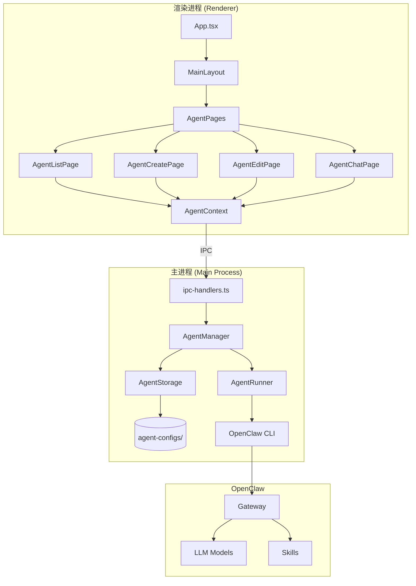
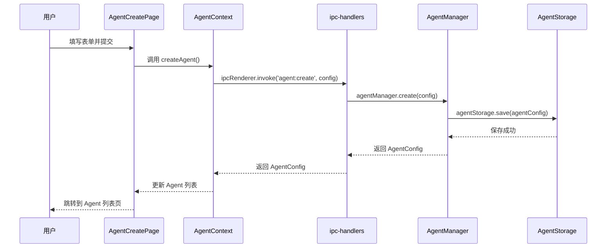
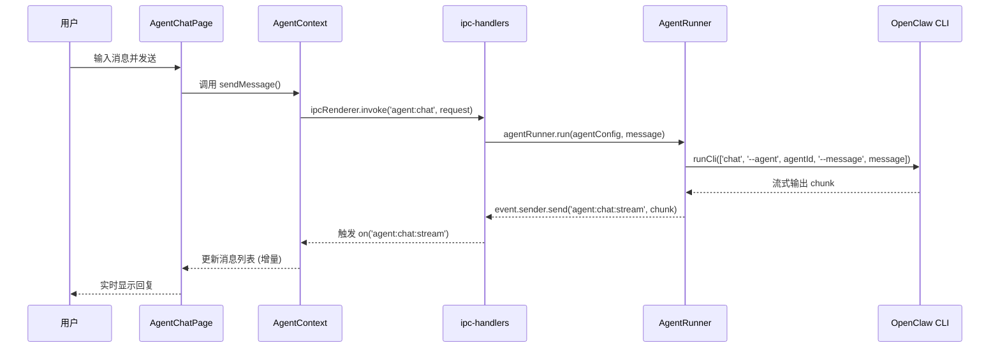

# Ccclaw Agent 系统架构设计文档

**文档版本**: v1.0  
**架构师**: 杉架  
**日期**: 2026-06-08  
**项目**: Ccclaw 本地化智能 Agent 系统  

---

## 1. 设计概述

### 1.1 设计原则

1. **保持架构一致性** - 遵循现有 Ccclaw 架构模式（Electron + React + IPC）
2. **最小侵入性** - 新增功能以插件形式集成，不影响现有功能
3. **本地优先** - 所有 Agent 数据本地存储，支持离线运行
4. **渐进式增强** - MVP 先实现核心功能，后续逐步增强

### 1.2 技术栈选型

| 层级 | 技术 | 理由 |
|------|------|------|
| **桌面框架** | Electron 33+ | 继承现有架构 |
| **前端框架** | React 18 + TypeScript | 继承现有架构 |
| **UI 组件库** | Mantine 8 | 继承现有架构 |
| **样式方案** | Tailwind CSS | 继承现有架构 |
| **状态管理** | React Context + useState | MVP 简单够用，后续可升级到 Zustand |
| **数据存储** | JSON 文件 | 简单、可调试、符合现有配置存储模式 |
| **IPC 通信** | Electron IPC | 继承现有模式 |
| **Agent 运行时** | OpenClaw CLI | 复用现有 CLI 集成 |

---

## 2. 系统架构图



---

## 3. 模块划分与职责

### 3.1 渲染进程模块

| 模块 | 文件路径 | 职责 |
|------|----------|------|
| **AgentContext** | `src/contexts/AgentContext.tsx` | Agent 状态管理（列表、当前选中、加载状态） |
| **AgentListPage** | `src/pages/AgentListPage.tsx` | Agent 列表展示、搜索、筛选、批量操作 |
| **AgentCreatePage** | `src/pages/AgentCreatePage.tsx` | Agent 创建表单（名称、描述、模型、提示词、参数） |
| **AgentEditPage** | `src/pages/AgentEditPage.tsx` | Agent 编辑（复用创建表单，预填充数据） |
| **AgentChatPage** | `src/pages/AgentChatPage.tsx` | Agent 对话界面（选择 Agent、流式输出、Skills 展示） |
| **AgentComponents** | `src/components/agent/` | AgentCard、AgentForm、AgentSelector 等共享组件 |

### 3.2 主进程模块

| 模块 | 文件路径 | 职责 |
|------|----------|------|
| **AgentManager** | `electron/main/agent-manager.ts` | Agent 业务逻辑层（创建、更新、删除、查询） |
| **AgentStorage** | `electron/main/agent-storage.ts` | Agent 配置持久化（JSON 文件读写） |
| **AgentRunner** | `electron/main/agent-runner.ts` | Agent 运行时管理（调用 OpenClaw CLI） |
| **ipc-handlers** | `electron/main/ipc-handlers.ts` | 注册 Agent 相关 IPC 接口 |

---

## 4. 数据结构设计

### 4.1 Agent 配置接口

```typescript
// src/types/agent.ts

export interface AgentConfig {
  id: string;                      // 唯一标识 (UUID)
  name: string;                    // Agent 名称
  description: string;             // Agent 描述
  avatar?: string;                 // 头像 (可选)
  model: AgentModelConfig;         // 模型配置
  systemPrompt: string;            // 系统提示词
  parameters: AgentParameters;      // 模型参数
  skills: AgentSkillConfig[];      // 启用的 Skills
  createdAt: string;              // 创建时间 (ISO 8601)
  updatedAt: string;              // 更新时间 (ISO 8601)
  status: AgentStatus;             // 状态
  disabled?: boolean;             // 是否停用
}

export interface AgentModelConfig {
  provider: string;               // 模型提供商 (openai, anthropic, google, local)
  modelId: string;                // 模型 ID
  apiKey?: string;                // API Key (可选，从全局配置读取)
}

export interface AgentParameters {
  temperature?: number;            // 温度 (0-2)
  topP?: number;                 // Top-P (0-1)
  maxTokens?: number;             // 最大 Token 数
  frequencyPenalty?: number;       // 频率惩罚 (-2 to 2)
  presencePenalty?: number;       // 存在惩罚 (-2 to 2)
}

export interface AgentSkillConfig {
  skillKey: string;               // Skill 标识
  enabled: boolean;               // 是否启用
  config?: Record<string, unknown>; // Skill 配置 (可选)
}

export type AgentStatus = 
  | 'idle'           // 空闲
  | 'running'        // 运行中
  | 'error'          // 错误
  | 'disabled'       // 已停用
  | 'initializing';  // 初始化中

export interface AgentChatSession {
  id: string;                      // 会话 ID
  agentId: string;                  // 关联的 Agent ID
  messages: AgentChatMessage[];     // 消息列表
  createdAt: string;                // 创建时间
  updatedAt: string;                // 更新时间
}

export interface AgentChatMessage {
  id: string;                      // 消息 ID
  role: 'user' | 'assistant' | 'system';
  content: string;                  // 消息内容
  timestamp: string;               // 时间戳
  skillCalls?: AgentSkillCall[];    // Skills 调用记录 (可选)
}

export interface AgentSkillCall {
  skillKey: string;                // Skill 标识
  input: unknown;                  // 输入参数
  output: unknown;                 // 输出结果
  durationMs: number;              // 执行耗时 (毫秒)
}
```

### 4.2 存储结构

```
~/.ccclaw-lite/
├── agent-configs/                # Agent 配置目录
│   ├── {agent-id-1}.json       # 单个 Agent 配置
│   ├── {agent-id-2}.json
│   └── ...
├── agent-sessions/              # Agent 会话目录
│   ├── {agent-id-1}/          # 按 Agent 分目录
│   │   ├── {session-id-1}.json
│   │   └── ...
│   └── ...
└── agent-stats.json             # Agent 统计信息 (调用次数、成功率等)
```

---

## 5. IPC 接口设计

### 5.1 接口列表

| Channel | 方向 | 说明 |
|---------|------|------|
| `agent:list` | Renderer → Main | 获取 Agent 列表 |
| `agent:get` | Renderer → Main | 获取单个 Agent 详情 |
| `agent:create` | Renderer → Main | 创建 Agent |
| `agent:update` | Renderer → Main | 更新 Agent |
| `agent:delete` | Renderer → Main | 删除 Agent |
| `agent:set-status` | Renderer → Main | 设置 Agent 状态 (启用/停用) |
| `agent:chat` | Renderer → Main | 发送聊天消息 |
| `agent:chat:stream` | Main → Renderer | 流式返回聊天响应 |
| `agent:sessions:list` | Renderer → Main | 获取 Agent 的会话列表 |
| `agent:sessions:get` | Renderer → Main | 获取单个会话详情 |
| `agent:sessions:delete` | Renderer → Main | 删除会话 |

### 5.2 接口定义

```typescript
// 获取 Agent 列表
ipcMain.handle('agent:list', (_event, filter?: {
  status?: AgentStatus;
  search?: string;
}) => Promise<AgentConfig[]>)

// 获取单个 Agent
ipcMain.handle('agent:get', (_event, agentId: string) => 
  Promise<AgentConfig | null>
)

// 创建 Agent
ipcMain.handle('agent:create', (_event, config: Omit<AgentConfig, 'id' | 'createdAt' | 'updatedAt'>) => 
  Promise<AgentConfig>
)

// 更新 Agent
ipcMain.handle('agent:update', (_event, agentId: string, updates: Partial<AgentConfig>) => 
  Promise<AgentConfig>
)

// 删除 Agent
ipcMain.handle('agent:delete', (_event, agentId: string, options?: {
  keepSessions?: boolean;  // 是否保留会话历史
}) => Promise<{ ok: boolean; error?: string }>)

// 设置 Agent 状态
ipcMain.handle('agent:set-status', (_event, agentId: string, status: AgentStatus) => 
  Promise<{ ok: boolean; error?: string }>
)

// 发送聊天消息
ipcMain.handle('agent:chat', (_event, request: {
  agentId: string;
  sessionId?: string;
  message: string;
}) => Promise<{ ok: boolean; sessionId: string; error?: string }>)

// 获取会话列表
ipcMain.handle('agent:sessions:list', (_event, agentId: string) => 
  Promise<AgentChatSession[]>
)

// 获取单个会话
ipcMain.handle('agent:sessions:get', (_event, sessionId: string) => 
  Promise<AgentChatSession | null>
)

// 删除会话
ipcMain.handle('agent:sessions:delete', (_event, sessionId: string) => 
  Promise<{ ok: boolean; error?: string }>
)
```

### 5.3 流式聊天接口 (Server-Sent Events)

```typescript
// Renderer 进程注册流式响应监听
ipcRenderer.on('agent:chat:stream', (_event, chunk: {
  sessionId: string;
  messageId: string;
  chunk: string;          // 增量文本
  done: boolean;          // 是否结束
  skillCalls?: AgentSkillCall[];  // Skills 调用记录 (可选)
}) => {
  // 更新 UI
})
```

---

## 6. 关键技术决策

### 6.1 数据存储方案对比

| 方案 | 优点 | 缺点 | 推荐 |
|------|------|------|------|
| **JSON 文件** | 简单、可调试、符合现有模式 | 大规模数据性能差 | ✅ MVP 推荐 |
| **SQLite** | 性能好、支持复杂查询 | 需要额外依赖、增加复杂度 | 后续版本考虑 |
| **IndexedDB** | 浏览器原生、异步 | 渲染进程才能用、主进程无法直接访问 | 不适用 |

**决策**: MVP 使用 JSON 文件存储，每个 Agent 一个文件。后续如果 Agent 数量超过 100 个，迁移到 SQLite。

### 6.2 状态管理方案对比

| 方案 | 优点 | 缺点 | 推荐 |
|------|------|------|------|
| **Context API** | 简单、无需额外依赖 | 性能较差 (大规模状态) | ✅ MVP 推荐 |
| **Zustand** | 轻量、性能好 | 需要额外依赖 | 后续版本考虑 |
| **Redux** | 生态完善、调试工具强 | 模板代码多、学习曲线陡 | 不推荐 |

**决策**: MVP 使用 React Context + useState，后续如果需要跨组件共享状态且性能成为问题，迁移到 Zustand。

### 6.3 Agent 运行隔离方案

| 方案 | 优点 | 缺点 | 推荐 |
|------|------|------|------|
| **单进程多实例** | 简单、资源消耗低 | 一个 Agent 崩溃可能影响其他 | ✅ MVP 推荐 |
| **进程隔离** | 稳定性高、相互隔离 | 资源消耗高、IPC 复杂度增加 | 后续版本考虑 |
| **线程隔离** | 平衡方案和进程隔离 | Node.js 线程隔离有限 | 不推荐 |

**决策**: MVP 使用单进程多实例模式，所有 Agent 通过 OpenClaw CLI 的单实例运行。后续如果需要运行本地模型且需要隔离，考虑进程隔离。

---

## 7. 数据流设计

### 7.1 Agent 创建流程



### 7.2 Agent 对话流程 (流式)



---

## 8. 集成设计

### 8.1 与 OpenClaw CLI 集成

Agent 系统通过 OpenClaw CLI 实现 Agent 的运行。集成方式：

1. **模型调用**: 通过 `openclaw chat` 命令，传入 Agent 的系统提示词和参数
2. **Skills 调用**: 通过 `openclaw skills` 命令，传入 Agent 启用的 Skills 列表
3. **流式输出**: 通过 CLI 的 stdout 流式读取，实时返回给渲染进程

示例命令：

```bash
# 运行 Agent
openclaw chat \
  --system-prompt "你是一个翻译助手..." \
  --model gpt-4 \
  --temperature 0.7 \
  --skills translate \
  --message "Hello, world"
```

### 8.2 与现有系统集成

| 现有功能 | 集成方式 |
|----------|--------------|
| **模型配置** | Agent 创建时，从现有模型列表选择 |
| **Skills 管理** | Agent 配置时，从现有 Skills 列表选择启用/禁用 |
| **网关状态** | Agent 运行时，检查网关状态，如果未运行则提示用户启动 |
| **聊天记录** | Agent 会话记录复用现有聊天记录存储模式 |

---

## 9. 性能优化方案

### 9.1 列表渲染优化

- 使用 **react-window** 实现虚拟滚动，支持 1000+ Agent 流畅展示
- 分页加载，每次加载 50 个 Agent
- 搜索和筛选在主进程进行，减少渲染压力

### 9.2 流式输出优化

- 使用 **ReadableStream** 读取 CLI stdout，避免阻塞
- 使用 **requestAnimationFrame** 节流 UI 更新，避免频繁重绘
- 消息内容分段渲染，优先显示文本内容，Skills 调用记录异步加载

### 9.3 数据持久化优化

- 使用 **防抖 (debounce)** 延迟保存，避免频繁写入磁盘
- 使用 **原子写入 (atomic write)** 避免文件损坏（参考现有 `atomicWriteJson` 工具）
- Agent 配置和会话数据分离存储，避免单次加载过多数据

---

## 10. 技术风险评估与应对

### 10.1 技术风险

| 风险 | 影响 | 应对措施 |
|------|------|----------|
| **OpenClaw CLI API 限制** | Agent 功能无法实现 | 1. 优先使用现有 CLI 命令；2. 如果 CLI 不支持，考虑直接调用 OpenClaw Gateway API；3. 向 OpenClaw 社区提 PR 添加所需功能 |
| **多 Agent 并发运行资源消耗过大** | 系统卡顿、崩溃 | 1. MVP 限制同时只能运行 1 个 Agent；2. 后续版本实现资源配额管理；3. 提供用户设置项，允许配置最大并发数 |
| **JSON 文件存储性能瓶颈** | Agent 列表加载慢 | 1. MVP 限制 Agent 数量 < 100；2. 实现分页和虚拟滚动；3. 后续版本迁移到 SQLite |
| **流式输出内存泄漏** | 应用崩溃 | 1. 使用流式读取，避免一次性加载全部内容；2. 实现消息内容截断 (最大 10MB)；3. 定期清理过期会话 |

### 10.2 应对策略

1. **渐进式开发**: MVP 先实现核心功能，后续逐步增强
2. **功能开关**: 新增功能通过配置开关，允许用户禁用
3. **性能监控**: 实现性能指标收集，及时发现瓶颈
4. **错误处理**: 所有 CLI 调用都有超时和错误恢复机制

---

## 11. 开发路线图 (技术视角)

### Phase 1: MVP 核心功能 (Week 1-6)

**Week 1-2: 数据结构与存储**
- [ ] 定义 AgentConfig 接口 (`src/types/agent.ts`)
- [ ] 实现 AgentStorage (`electron/main/agent-storage.ts`)
- [ ] 实现 AgentManager (`electron/main/agent-manager.ts`)
- [ ] 编写单元测试

**Week 3: IPC 接口与状态管理**
- [ ] 注册 IPC  handlers (`electron/main/ipc-handlers.ts`)
- [ ] 实现 AgentContext (`src/contexts/AgentContext.tsx`)
- [ ] 实现 Preload API (`electron/preload/index.ts`)

**Week 4: UI - Agent 列表与创建**
- [ ] 实现 AgentListPage (`src/pages/AgentListPage.tsx`)
- [ ] 实现 AgentCreatePage (`src/pages/AgentCreatePage.tsx`)
- [ ] 实现 AgentCard 组件 (`src/components/agent/AgentCard.tsx`)
- [ ] 实现 AgentForm 组件 (`src/components/agent/AgentForm.tsx`)

**Week 5: UI - Agent 对话**
- [ ] 实现 AgentRunner (`electron/main/agent-runner.ts`)
- [ ] 实现 AgentChatPage (`src/pages/AgentChatPage.tsx`)
- [ ] 实现流式输出展示
- [ ] 实现 Skills 调用展示

**Week 6: UI - Agent 编辑与删除 + 测试**
- [ ] 实现 AgentEditPage (`src/pages/AgentEditPage.tsx`)
- [ ] 实现删除、停用/启用功能
- [ ] 编写集成测试
- [ ] 性能优化

### Phase 2: 能力提升 (Week 7-10)

**Week 7-8: Skills 编排**
- [ ] Agent 详情页添加 Skills 管理
- [ ] 实现 Skills 启用/禁用
- [ ] 实现 Skills 优先级排序 (拖拽)

**Week 9: Agent 性能监控**
- [ ] 实现性能仪表盘
- [ ] 实现使用统计
- [ ] 实现错误日志查看

**Week 10: 测试与优化**
- [ ] 编写 E2E 测试
- [ ] 性能测试
- [ ] Bug 修复

---

## 12. 附录

### 12.1 参考资料

- [Electron IPC 官方文档](https://www.electronjs.org/docs/latest/tutorial/ipc)
- [React Context 官方文档](https://react.dev/reference/react/useContext)
- [Mantine UI 官方文档](https://mantine.dev/)
- [OpenClaw CLI 官方文档](https://openclaw.ai/docs)

### 12.2 相关文件

| 文件 | 说明 |
|------|------|
| `electron/main/ipc-handlers.ts` | 现有 IPC  handlers，新增 Agent 相关接口 |
| `electron/main/cli.ts` | 现有 CLI 封装，AgentRunner 复用 |
| `src/App.tsx` | 应用入口，添加 Agent 页面路由 |
| `src/shared/` | 共享类型定义，添加 Agent 相关类型 |

---

**文档结束**
