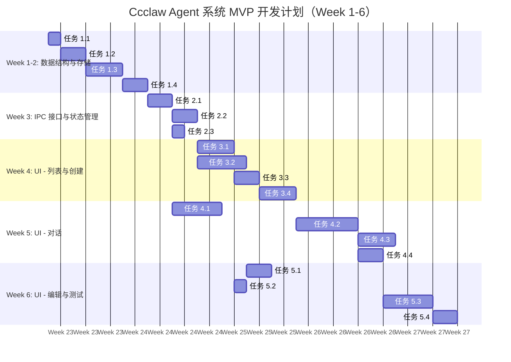

# Ccclaw Agent 系统项目规划

**文档版本**: v1.0  
**规划人**: 景润（项目规划师）  
**日期**: 2026-06-08  
**项目**: Ccclaw 本地化智能 Agent 系统  

---

## 1. 项目概述

### 1.1 项目目标

在 Ccclaw 现有架构基础上，实现类似 WorkBuddy 的本地化智能 Agent 系统，包括：
1. Agent 编排功能 - 支持创建、配置、协作和编排多个 Agent
2. Agent 管理功能 - 提供 Agent 全生命周期管理能力
3. 本地化智能 Agent 能力 - 支持本地模型、离线运行、数据隐私保护

### 1.2 MVP 范围（V1.0）

根据 PRD 和架构设计，MVP 包含 4 个 Must Have 用户故事：
1. **Agent 创建与基础配置**（8 故事点）
2. **Agent 列表与状态查看**（5 故事点）
3. **Agent 对话交互**（13 故事点）
4. **Agent 编辑与删除**（5 故事点）

**MVP 总故事点**: 31 故事点  
**预计工期**: 6 周（Week 1-6）

---

## 2. 工作分解结构 (WBS)

### 2.1 Phase 1: MVP 核心功能（Week 1-6）

#### Week 1-2: 数据结构与存储

**任务 1.1**: 定义 AgentConfig 接口
- **负责人**: 后端开发工程师
- **输出**: `src/types/agent.ts`
- **验收标准**: TypeScript 接口定义完整，包含所有可能的 Agent 配置字段
- **预计工时**: 4 小时
- **依赖**: 无

**任务 1.2**: 实现 AgentStorage 模块
- **负责人**: 后端开发工程师
- **输出**: `electron/main/agent-storage.ts`
- **验收标准**: 
  - JSON 文件读写功能正常
  - 支持原子写入（避免文件损坏）
  - 错误处理完善
- **预计工时**: 8 小时
- **依赖**: 任务 1.1

**任务 1.3**: 实现 AgentManager 模块
- **负责人**: 后端开发工程师
- **输出**: `electron/main/agent-manager.ts`
- **验收标准**:
  - 实现 Agent 的 CRUD 操作
  - 业务逻辑完整（创建、更新、删除、查询）
  - 错误处理完善
- **预计工时**: 12 小时
- **依赖**: 任务 1.2

**任务 1.4**: 编写单元测试
- **负责人**: 测试工程师
- **输出**: `electron/main/__tests__/agent-*.test.ts`
- **验收标准**:
  - 测试覆盖率 > 80%
  - 所有测试用例通过
- **预计工时**: 8 小时
- **依赖**: 任务 1.2, 1.3

---

#### Week 3: IPC 接口与状态管理

**任务 2.1**: 注册 IPC handlers
- **负责人**: 后端开发工程师
- **输出**: `electron/main/ipc-handlers.ts`（新增 Agent 相关接口）
- **验收标准**:
  - 实现所有 Agent 相关的 IPC 接口（12 个）
  - 参数验证完整
  - 错误处理完善
- **预计工时**: 10 小时
- **依赖**: 任务 1.3

**任务 2.2**: 实现 AgentContext
- **负责人**: 前端开发工程师
- **输出**: `src/contexts/AgentContext.tsx`
- **验收标准**:
  - 状态管理完整（列表、当前选中、加载状态）
  - 提供清晰的 API 给组件使用
- **预计工时**: 8 小时
- **依赖**: 任务 2.1

**任务 2.3**: 实现 Preload API
- **负责人**: 后端开发工程师
- **输出**: `electron/preload/index.ts`（新增 Agent 相关 API）
- **验收标准**:
  - 类型定义完整
  - 安全性（上下文隔离）保证
- **预计工时**: 4 小时
- **依赖**: 任务 2.1

---

#### Week 4: UI - Agent 列表与创建

**任务 3.1**: 实现 AgentListPage
- **负责人**: 前端开发工程师
- **输出**: `src/pages/AgentListPage.tsx`
- **验收标准**:
  - Agent 列表展示完整
  - 支持搜索、筛选、排序
  - UI 符合 Mantine 设计规范
- **预计工时**: 12 小时
- **依赖**: 任务 2.2

**任务 3.2**: 实现 AgentCreatePage
- **负责人**: 前端开发工程师
- **输出**: `src/pages/AgentCreatePage.tsx`
- **验收标准**:
  - 创建表单完整（名称、描述、模型、提示词、参数）
  - 表单验证完整
  - 创建成功后跳转至列表页
- **预计工时**: 16 小时
- **依赖**: 任务 2.2

**任务 3.3**: 实现 AgentCard 组件
- **负责人**: 前端开发工程师
- **输出**: `src/components/agent/AgentCard.tsx`
- **验收标准**:
  - 显示 Agent 关键信息（名称、头像、状态、最后活跃时间）
  - 支持点击跳转详情
  - 支持批量操作（删除、停用）
- **预计工时**: 8 小时
- **依赖**: 无

**任务 3.4**: 实现 AgentForm 组件
- **负责人**: 前端开发工程师
- **输出**: `src/components/agent/AgentForm.tsx`
- **验收标准**:
  - 表单组件复用（创建和编辑页面）
  - 支持所有 Agent 配置字段
  - 表单验证完整
- **预计工时**: 12 小时
- **依赖**: 任务 3.3

---

#### Week 5: UI - Agent 对话

**任务 4.1**: 实现 AgentRunner 模块
- **负责人**: 后端开发工程师
- **输出**: `electron/main/agent-runner.ts`
- **验收标准**:
  - 调用 OpenClaw CLI 成功
  - 流式输出支持
  - 错误处理完善
- **预计工时**: 16 小时
- **依赖**: 任务 2.1

**任务 4.2**: 实现 AgentChatPage
- **负责人**: 前端开发工程师
- **输出**: `src/pages/AgentChatPage.tsx`
- **验收标准**:
  - 对话界面完整
  - 支持流式输出展示
  - 支持 Skills 调用展示
- **预计工时**: 20 小时
- **依赖**: 任务 4.1, 任务 2.2

**任务 4.3**: 实现流式输出展示
- **负责人**: 前端开发工程师
- **输出**: `src/components/agent/ChatMessage.tsx`
- **验收标准**:
  - 流式输出流畅（无卡顿）
  - 支持 Markdown 渲染
  - 支持代码高亮
- **预计工时**: 12 小时
- **依赖**: 任务 4.2

**任务 4.4**: 实现 Skills 调用展示
- **负责人**: 前端开发工程师
- **输出**: `src/components/agent/SkillCall.tsx`
- **验收标准**:
  - 显示 Skills 调用记录
  - 展示输入/输出/耗时
- **预计工时**: 8 小时
- **依赖**: 任务 4.2

---

#### Week 6: UI - Agent 编辑与删除 + 测试

**任务 5.1**: 实现 AgentEditPage
- **负责人**: 前端开发工程师
- **输出**: `src/pages/AgentEditPage.tsx`
- **验收标准**:
  - 编辑表单完整（复用 AgentForm）
  - 预填充数据正确
  - 保存成功后跳转至列表页
- **预计工时**: 8 小时
- **依赖**: 任务 3.2, 任务 3.4

**任务 5.2**: 实现删除、停用/启用功能
- **负责人**: 前端开发工程师
- **输出**: `src/components/agent/AgentActions.tsx`
- **验收标准**:
  - 删除前二次确认
  - 支持保留/删除会话历史
  - 停用/启用功能正常
- **预计工时**: 6 小时
- **依赖**: 任务 3.1

**任务 5.3**: 编写集成测试
- **负责人**: 测试工程师
- **输出**: `src/__tests__/agent-*.test.tsx`
- **验收标准**:
  - 测试覆盖率 > 70%
  - 所有测试用例通过
- **预计工时**: 16 小时
- **依赖**: 所有前置任务

**任务 5.4**: 性能优化
- **负责人**: 前端开发工程师
- **输出**: 代码优化
- **验收标准**:
  - Agent 列表加载时间 < 1 秒（50 个 Agent）
  - 流式输出流畅（无卡顿）
- **预计工时**: 8 小时
- **依赖**: 任务 5.3

---

### 2.2 Phase 2: 能力提升（Week 7-10）

#### Week 7-8: Skills 编排

**任务 6.1**: Agent 详情页添加 Skills 管理
- **负责人**: 前端开发工程师
- **预计工时**: 12 小时

**任务 6.2**: 实现 Skills 启用/禁用
- **负责人**: 前端开发工程师
- **预计工时**: 8 小时

**任务 6.3**: 实现 Skills 优先级排序（拖拽）
- **负责人**: 前端开发工程师
- **预计工时**: 12 小时

---

#### Week 9: Agent 性能监控

**任务 7.1**: 实现性能仪表盘
- **负责人**: 前端开发工程师
- **预计工时**: 16 小时

**任务 7.2**: 实现使用统计
- **负责人**: 后端开发工程师
- **预计工时**: 8 小时

**任务 7.3**: 实现错误日志查看
- **负责人**: 后端开发工程师
- **预计工时**: 8 小时

---

#### Week 10: 测试与优化

**任务 8.1**: 编写 E2E 测试
- **负责人**: 测试工程师
- **预计工时**: 16 小时

**任务 8.2**: 性能测试
- **负责人**: 测试工程师
- **预计工时**: 8 小时

**任务 8.3**: Bug 修复
- **负责人**: 开发团队
- **预计工时**: 16 小时

---

## 3. 任务依赖关系与关键路径

### 3.1 依赖关系图

```
任务 1.1 (AgentConfig 接口)
  └─> 任务 1.2 (AgentStorage)
       └─> 任务 1.3 (AgentManager)
            └─> 任务 2.1 (IPC handlers)
                 ├─> 任务 2.2 (AgentContext)
                 │    ├─> 任务 3.1 (AgentListPage)
                 │    │    └─> 任务 5.2 (删除/停用)
                 │    ├─> 任务 3.2 (AgentCreatePage)
                 │    │    └─> 任务 5.1 (AgentEditPage)
                 │    └─> 任务 4.2 (AgentChatPage)
                 │         ├─> 任务 4.3 (流式输出)
                 │         └─> 任务 4.4 (Skills 展示)
                 ├─> 任务 2.3 (Preload API)
                 └─> 任务 4.1 (AgentRunner)
                      └─> 任务 4.2 (AgentChatPage)
```

### 3.2 关键路径

**关键路径**（最长路径，决定项目总工期）：
```
任务 1.1 → 任务 1.2 → 任务 1.3 → 任务 2.1 → 任务 2.2 → 任务 4.2 → 任务 4.3 / 任务 4.4
```

**关键路径总工时**: 4h + 8h + 12h + 10h + 8h + 20h + 12h = **74 小时**  
**按每天 8 小时工作制计算**: 74h / 8h = **9.25 天** ≈ **2 周**

---

## 4. 资源分配

### 4.1 团队成员与技能

| 角色 | 姓名 | 技能 | 可用工时/周 |
|------|------|------|-------------|
| **后端开发工程师** | 杉架 | Electron 主进程、Node.js、TypeScript | 40 小时 |
| **前端开发工程师** | 茗需 | React、TypeScript、Mantine UI | 40 小时 |
| **测试工程师** | 卫士 | 单元测试、集成测试、E2E 测试 | 40 小时 |
| **项目规划师** | 景润 | 项目管理、任务分解、进度跟踪 | 20 小时 |

### 4.2 任务分配（Week 1-6）

| 任务 | 负责人 | 预计工时 | Week |
|------|--------|----------|------|
| 任务 1.1 | 杉架 | 4h | Week 1 |
| 任务 1.2 | 杉架 | 8h | Week 1 |
| 任务 1.3 | 杉架 | 12h | Week 1-2 |
| 任务 1.4 | 卫士 | 8h | Week 2 |
| 任务 2.1 | 杉架 | 10h | Week 3 |
| 任务 2.2 | 茗需 | 8h | Week 3 |
| 任务 2.3 | 杉架 | 4h | Week 3 |
| 任务 3.1 | 茗需 | 12h | Week 4 |
| 任务 3.2 | 茗需 | 16h | Week 4 |
| 任务 3.3 | 茗需 | 8h | Week 4 |
| 任务 3.4 | 茗需 | 12h | Week 4 |
| 任务 4.1 | 杉架 | 16h | Week 5 |
| 任务 4.2 | 茗需 | 20h | Week 5 |
| 任务 4.3 | 茗需 | 12h | Week 5 |
| 任务 4.4 | 茗需 | 8h | Week 5 |
| 任务 5.1 | 茗需 | 8h | Week 6 |
| 任务 5.2 | 茗需 | 6h | Week 6 |
| 任务 5.3 | 卫士 | 16h | Week 6 |
| 任务 5.4 | 茗需 | 8h | Week 6 |

**总计**: 206 小时

### 4.3 资源负载分析

| 角色 | 总工时 | 可用工时 (6 weeks) | 负载率 |
|------|--------|---------------------|--------|
| **杉架** | 70h | 240h | 29% |
| **茗需** | 98h | 240h | 41% |
| **卫士** | 24h | 240h | 10% |
| **景润** | 8h | 120h | 7% |

**结论**: 资源负载合理，茗需（前端开发）负载较高，但仍在可接受范围内。

---

## 5. 时间估算与甘特图

### 5.1 时间估算（Week 1-6）

| Week | 任务 | 负责人 | 状态 |
|------|------|--------|------|
| **Week 1** | 任务 1.1, 1.2, 1.3 (部分) | 杉架 | 计划中 |
| **Week 2** | 任务 1.3 (剩余), 1.4 | 杉架, 卫士 | 计划中 |
| **Week 3** | 任务 2.1, 2.2, 2.3 | 杉架, 茗需 | 计划中 |
| **Week 4** | 任务 3.1, 3.2, 3.3, 3.4 | 茗需 | 计划中 |
| **Week 5** | 任务 4.1, 4.2, 4.3, 4.4 | 杉架, 茗需 | 计划中 |
| **Week 6** | 任务 5.1, 5.2, 5.3, 5.4 | 茗需, 卫士 | 计划中 |

### 5.2 甘特图（Mermaid）



---

## 6. 风险评估与应对

### 6.1 技术风险

| 风险 | 影响 | 概率 | 应对措施 | 负责人 |
|------|------|------|----------|--------|
| **OpenClaw CLI API 限制** | 高 | 中 | 1. 优先使用现有 CLI 命令；2. 如果 CLI 不支持，考虑直接调用 OpenClaw Gateway API；3. 向 OpenClaw 社区提 PR | 杉架 |
| **多 Agent 并发运行资源消耗过大** | 中 | 低 | 1. MVP 限制同时只能运行 1 个 Agent；2. 后续版本实现资源配额管理 | 杉架 |
| **JSON 文件存储性能瓶颈** | 中 | 中 | 1. MVP 限制 Agent 数量 < 100；2. 实现分页和虚拟滚动；3. 后续版本迁移到 SQLite | 杉架 |
| **流式输出内存泄漏** | 高 | 低 | 1. 使用流式读取，避免一次性加载全部内容；2. 实现消息内容截断；3. 定期清理过期会话 | 茗需 |

### 6.2 项目风险

| 风险 | 影响 | 概率 | 应对措施 | 负责人 |
|------|------|------|----------|--------|
| **需求变更** | 中 | 中 | 1. 明确 MVP 范围，严格控制变更；2. 变更必须经过产品负责人批准 | 景润 |
| **开发人员请假/离职** | 高 | 低 | 1. 文档及时更新；2. 代码审查确保知识共享；3. 交叉培训 | 团队 lead |
| **测试环境不稳定** | 中 | 中 | 1. 搭建稳定的测试环境；2. 提供本地测试指南 | 卫士 |
| **进度延期** | 高 | 中 | 1. 每日站会跟踪进度；2. 关键路径任务优先保证；3. 准备加班或增派资源 | 景润 |

---

## 7. 里程碑与交付物

### 7.1 里程碑

| 里程碑 | 日期 | 交付物 |
|--------|------|--------|
| **M1: 数据结构与存储完成** | Week 2 结束 | AgentConfig 接口、AgentStorage、AgentManager、单元测试 |
| **M2: IPC 接口与状态管理完成** | Week 3 结束 | IPC handlers、AgentContext、Preload API |
| **M3: UI - 列表与创建完成** | Week 4 结束 | AgentListPage、AgentCreatePage、AgentCard、AgentForm |
| **M4: UI - 对话完成** | Week 5 结束 | AgentRunner、AgentChatPage、流式输出、Skills 展示 |
| **M5: MVP 完成** | Week 6 结束 | AgentEditPage、删除/停用功能、集成测试、性能优化 |

### 7.2 交付物清单

| 交付物 | 文件路径 | 负责人 | 验收标准 |
|--------|----------|--------|----------|
| AgentConfig 接口 | `src/types/agent.ts` | 杉架 | TypeScript 接口定义完整 |
| AgentStorage 模块 | `electron/main/agent-storage.ts` | 杉架 | JSON 文件读写正常，原子写入 |
| AgentManager 模块 | `electron/main/agent-manager.ts` | 杉架 | CRUD 操作完整，业务逻辑完整 |
| 单元测试 | `electron/main/__tests__/agent-*.test.ts` | 卫士 | 测试覆盖率 > 80% |
| IPC handlers | `electron/main/ipc-handlers.ts` | 杉架 | 12 个接口实现完整 |
| AgentContext | `src/contexts/AgentContext.tsx` | 茗需 | 状态管理完整，API 清晰 |
| Preload API | `electron/preload/index.ts` | 杉架 | 类型定义完整，安全性保证 |
| AgentListPage | `src/pages/AgentListPage.tsx` | 茗需 | 列表展示完整，搜索/筛选/排序正常 |
| AgentCreatePage | `src/pages/AgentCreatePage.tsx` | 茗需 | 创建表单完整，表单验证完整 |
| AgentCard 组件 | `src/components/agent/AgentCard.tsx` | 茗需 | 显示信息完整，支持点击跳转 |
| AgentForm 组件 | `src/components/agent/AgentForm.tsx` | 茗需 | 表单组件复用，支持所有配置字段 |
| AgentRunner 模块 | `electron/main/agent-runner.ts` | 杉架 | 调用 OpenClaw CLI 成功，流式输出支持 |
| AgentChatPage | `src/pages/AgentChatPage.tsx` | 茗需 | 对话界面完整，流式输出展示 |
| 流式输出展示 | `src/components/agent/ChatMessage.tsx` | 茗需 | 流式输出流畅，Markdown 渲染 |
| Skills 调用展示 | `src/components/agent/SkillCall.tsx` | 茗需 | 显示 Skills 调用记录 |
| AgentEditPage | `src/pages/AgentEditPage.tsx` | 茗需 | 编辑表单完整，预填充数据正确 |
| 删除/停用功能 | `src/components/agent/AgentActions.tsx` | 茗需 | 删除前二次确认，停用/启用正常 |
| 集成测试 | `src/__tests__/agent-*.test.tsx` | 卫士 | 测试覆盖率 > 70% |
| 性能优化 | 代码优化 | 茗需 | 列表加载 < 1s，流式输出流畅 |

---

## 8. 沟通计划

### 8.1 会议安排

| 会议 | 频率 | 参与者 | 目的 |
|------|------|--------|------|
| **每日站会** | 每天 9:00 | 全体团队成员 | 同步进度，识别风险 |
| **周会** | 每周五 15:00 | 全体团队成员 | 回顾本周工作，规划下周任务 |
| **需求评审会** | 按需 | 产品、开发、测试 | 评审需求变更 |
| **设计评审会** | Week 2 结束 | 开发、测试 | 评审技术设计 |
| **代码审查** | 持续 | 开发团队 | 确保代码质量 |
| **演示会** | 每个里程碑结束 | 全体团队成员 | 演示交付物，收集反馈 |

### 8.2 报告机制

| 报告 | 频率 | 负责人 | 目的 |
|------|------|--------|------|
| **每日进度报告** | 每天 | 各负责人 | 同步任务进度 |
| **每周状态报告** | 每周五 | 景润 | 汇报项目整体进度 |
| **风险报告** | 按需 | 景润 | 及时上报项目风险 |
| **里程碑报告** | 每个里程碑结束 | 景润 | 汇报里程碑完成情况 |

---

## 9. 质量保证计划

### 9.1 代码质量

1. **代码审查**: 所有代码必须经过至少 1 位同事审查
2. **静态分析**: 使用 ESLint + TypeScript 进行静态分析
3. **单元测试**: 测试覆盖率 > 80%（后端），> 70%（前端）
4. **集成测试**: 所有用户故事必须有集成测试

### 9.2 性能标准

1. **Agent 列表加载时间** < 1 秒（50 个 Agent）
2. **Agent 对话响应时间** < 3 秒（取决于模型推理速度）
3. **流式输出流畅**（无卡顿）
4. **内存占用** < 500MB（单 Agent 运行）

### 9.3 安全标准

1. **Agent 配置数据加密存储**（AES-256）
2. **IPC 接口参数验证**（避免注入攻击）
3. **错误处理完善**（避免应用崩溃）

---

## 10. 附录

### 10.1 参考资料

- [Ccclaw Agent 系统 PRD](./agent-system-prd.md)
- [Ccclaw Agent 系统架构设计](./agent-system-architecture.md)
- [Electron 官方文档](https://www.electronjs.org/docs)
- [React 官方文档](https://react.dev/)
- [Mantine UI 官方文档](https://mantine.dev/)

### 10.2 相关工具

- **项目管理**: GanttProject（甘特图）
- **代码管理**: Git + GitHub
- **持续集成**: GitHub Actions
- **测试工具**: Jest + React Testing Library
- **性能监控**: Chrome DevTools

---

**文档结束**
